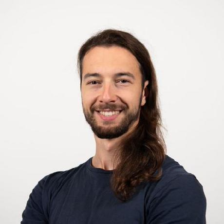
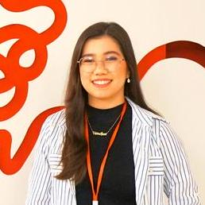
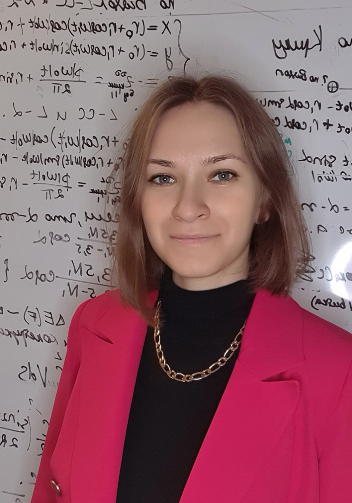

# Aim

To provide an overview of core software development practices that support efficient research project management and its reproducibility.

# Description

Less time for programming, more time for science. This mini course introduces the basics of software development. In two hours, sessions, we cover tools and practices that are used by researchers to manage their projects effectively. You will not learn how to write a specific code, but the way to think about your code from bird’s eye view. The course is designed to be language agnostic, but we will use Python for practical examples. 

```{mermaid}
flowchart LR
A[Experiment] --> B[Data]

%% Parallel paths (layout only)
subgraph Reproducible
direction TB
C(**GECS**)
end

subgraph Irreproducible
direction TB
E[Ad hoc]
end

B edge1@==> C
edge1@{ animate: slow }
C edge2@==> G[Results]
edge2@{ animate: slow }

B -.-> E
E -.-x G

%% Node styles
classDef gecs fill:#cfe9e5,stroke:transparent,color:#000
classDef adhoc fill:#eeeeee,stroke:transparent,color:#000
classDef neutral fill:#f7f7f7,stroke:transparent,color:#000
classDef results fill:#e6dff1,stroke:transparent,color:#000

%% Apply styles
class C gecs
class E adhoc
class A,B neutral
class G results

%% Make subgraphs invisible
style Reproducible fill:transparent,stroke-width:0px
style Irreproducible fill:transparent,stroke-width:0px

```


# Target Audience

This course is for researchers who want to learn how to automate repetitive tasks in data analysis. Some prior programming experience is helpful but not required.

# Schedule

**Time:** Friday 13:00-15:00 \
**Location:** L3B700 (near-ish the GS counter)

| Date         | Session             |
|--------------|---------------------|
| September 11 | Version control     |
| September 18 | Project structure   |
| September 25 | Virtual environment |
| October 2    | Automation          |
| October 9    | Testing             |


## Getting Started

Make sure to have your computer ready for the course. Please check out the [Setting Up](lessons/setting-up.qmd) section. Those who are not familiar with terminal should also check out the [Terminal](lessons/terminal.qmd) section.

If you need help with configuring your computer for the course, come to this one-time setup session before the course starts.

**Date and time:** Wednesday, September 9, 12:00-13:00\
**Location:** C102 (The Cafe Tancha meeting room)\

# Registration
For official details, see [the Graduate School hosted website](https://groups.oist.jp/grad/event/mini-course-good-enough-coding-science-gecs) on TIDA.

<button class="btn btn-primary" onclick="window.open('https://forms.cloud.microsoft/pages/responsepage.aspx?id=jfvA2Fa7u0SfSsWOdGVlLiSomztCAudOh1m7OGIuZhhUNTFaSUgwNFNKNzJUWTVRWUFHVjNNWVZZTiQlQCN0PWcu&route=shorturl', '_blank')">Register Here</button>

# People

<div style="display: flex; flex-wrap: wrap; gap: 2rem; margin: 1rem 0 2rem;">

<div style="flex: 0 1 180px; text-align: center;">



**Igors Dubanevics**<br>
Year 5 · [@igorsdub](https://github.com/igorsdub)

</div>

<div style="flex: 0 1 180px; text-align: center;">



**Victoria Yutuki**<br>
Year 2 · [@viyuetuki](https://github.com/viyuetuki)

</div>

<div style="flex: 0 1 180px; text-align: center;">



**Olga Bagrova**<br>
Year 1 · [@Olga-Bagrova](https://github.com/olga-bagrova)

</div>

</div>

# Manifesto

> "Teach a course you want to attend."
>
> adapted from Austin Kleon, *Steal Like an Artist*

We will learn from you more than you will learn from us at this course. Stupid question permission is granted. Suggestions, tips, and corrections are welcome!

# What this course is NOT?

-   Introduction to a specific programming language (e.g., Python, R, etc.)
-   Numerical simulations/modeling course
-   High Performance Computing (HPC) training

# Inspiration & Credits

## Acknowledgements

Arthur Turrell, Greg Wilson and The Carpentries, Justin Bois, Richard McElreath, and the MulQuaBio collective.

## References

> "Good artists copy, great artists steal."
>
> — Pablo Picasso

-   [Coding for Economists](https://aeturrell.github.io/coding-for-economists) by Arthur Turrell
-   [Python for Data Science](https://aeturrell.github.io/python4DS) by Arthur Turrell
-   [bootcamp](https://justinbois.github.io/bootcamp) by Justin Bois
-   [Research Software Engineering with Python](https://third-bit.com/py-rse) by The Carpentries 
-   [The Multilingual Quantitative Biologist](https://mulquabio.github.io/MQB) by the MulQuaBio collective
