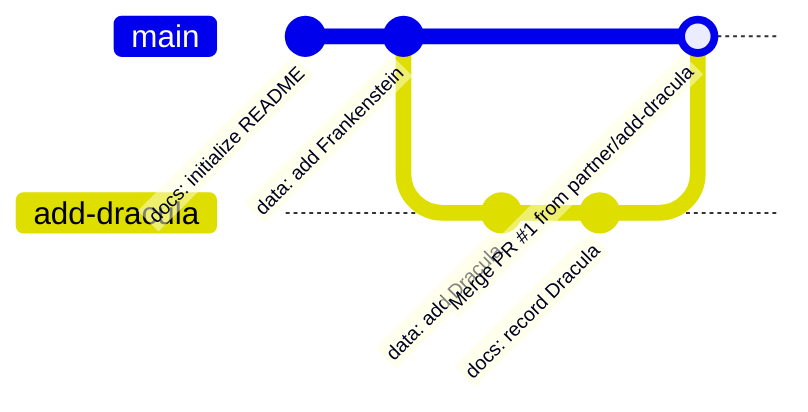

> "Collaboration is the cornerstone of scientific progress. Transparent, version-controlled workflows ensure that progress is reproducible, auditable, and shared."

In this session, you will start a cumulative research project from an initially empty repository. You will document the project, acquire plain-text book data from Project Gutenberg, publish the repository to GitHub, and collaborate with a partner using an issue-driven fork, branch, pull request, and merge commit workflow.

::: {.callout-note title="Recovery Checkpoint: git-collaboration" collapse="true"}
If you join late or need to reset your project to the verified end state of this session, you can download the prepared snapshot from the canonical reference repository:

- Tag: [`git-collaboration`](https://github.com/oist/bookstats/tree/git-collaboration)
- Raw book assets: `assets/data/raw/` in the course materials.
:::

## Learning Outcomes

By the end of this two-hour session, you will be able to:

1. Initialize and configure a Git repository from an empty directory using VS Code.
2. Structure an evolving `README.md` that tracks data sources, file conventions, and explicit reproduction placeholders.
3. Apply structured data naming conventions to plain-text Project Gutenberg books.
4. Distinguish between **forking** and **cloning** when contributing to a repository where you do not have direct write permissions.
5. Execute an issue-driven collaboration workflow: opening an issue, creating a short-lived branch, making focused commits, and opening a pull request referencing the issue with `Closes #N`.
6. Review a pull request diff, leave constructive review comments, and merge using **Create a merge commit**.
7. Clean up completed local and remote feature branches safely.
8. Inspect and navigate the branch-and-merge history graph in VS Code.

---

## The Course Project: Gutenberg Book Analysis

Throughout GECS, each participant builds their own independent repository (such as `gutenberg-analysis`). We analyze word distributions and test power-law relationships (Zipf's law) across classic literature from [Project Gutenberg](https://www.gutenberg.org/).

We commit raw book text files directly into the course repository because they are small, open-access, and redistributable.

::: {.callout-important}
In real laboratory research, raw experimental data may be hundreds of gigabytes, contain patient-sensitive information, or be governed by strict proprietary licenses. Real research projects often store raw data in managed object storage (such as S3 or GCS) or shared network filesystems, recording immutable identifiers (such as DOIs or checksums) in Git rather than the raw data itself.
:::

### Starting-State Tree

Your project begins completely empty:

```text
gutenberg-analysis/
```

---

## Step 1: Create an Empty Repository and Initialize Git

We use **VS Code** as our primary interface. Adjacent terminal commands are provided in collapsible callouts for learners who prefer the command line.

1. Launch VS Code.
2. Select **File** > **Open Folder...** (macOS: `Cmd+O`, Windows/WSL: `Ctrl+O`).
3. Click **New Folder**, name it `gutenberg-analysis`, and click **Open**.
4. In the Activity Bar on the left, click the **Source Control** icon (`Ctrl+Shift+G` or `Cmd+Shift+G`).
5. Click **Initialize Repository**.

::: {.callout-tip title="Terminal equivalent" collapse="true"}
```bash
mkdir gutenberg-analysis
cd gutenberg-analysis
git init -b main
```
:::

VS Code initializes a hidden `.git/` directory. Your folder is now a Git repository tracking the default branch (`main`).

---

## Step 2: Author a Minimal README

A project should always introduce itself. Create a minimal `README.md` in the root of your workspace:

1. In VS Code Explorer (`Cmd+Shift+E` / `Ctrl+Shift+E`), click the **New File** icon and name it `README.md`.
2. Add the following content, adjusting the author name to your own:

```markdown
# gutenberg-analysis

A cumulative research project analyzing word frequency distributions in classic literature from Project Gutenberg.

## Purpose

This project investigates word frequency patterns and descriptive Zipf's law fits across classic literature.

## Books Analyzed

| Gutenberg ID | Title | Author | Source URL |
|---|---|---|---|

### Filename Convention

Raw book text files are stored using the convention:
`<five-digit-gutenberg-id>_<hyphenated-short-title>.txt`

The leading 5-digit number is the official Project Gutenberg ebook ID padded with zeros, followed by an underscore separator and a lowercase hyphenated short title.

## Repository Contents

- `README.md`: Project description and book inventory.

## Setup Instructions

*(To be added in Session 2)*

## Running the Analysis

*(To be added in Session 2)*

## Reproducing Results

*(To be added in Session 4)*
```

3. Save the file (`Cmd+S` / `Ctrl+S`).
4. Switch to the **Source Control** view.
5. Click the **`+`** icon next to `README.md` to stage the file.
6. Enter the commit message:
   ```text
   docs: initialize project with README
   ```
7. Click **Commit** (or press `Cmd+Enter` / `Ctrl+Enter`).

::: {.callout-tip title="Terminal equivalent" collapse="true"}
```bash
git add README.md
git commit -m "docs: initialize project with README"
```
:::

---

## Step 3: Download and Name Your First Book

Project Gutenberg assigns every public domain work an integer eBook ID. To ensure consistent sorting and unambiguous file paths, our project uses the following convention:

```text
<five-digit-gutenberg-id>_<hyphenated-short-title>.txt
```

For our first book, we will use Mary Wollstonecraft Shelley's *Frankenstein; or, The Modern Prometheus* (eBook #84):

```text
00084_frankenstein.txt
```

1. Download the plain text UTF-8 version of *Frankenstein* from Project Gutenberg: [https://www.gutenberg.org/ebooks/84](https://www.gutenberg.org/ebooks/84) (or use the mirror in the course assets).
2. Save the file directly into your `gutenberg-analysis` folder as `00084_frankenstein.txt`.
3. Open `README.md` and add *Frankenstein* to the **Books Analyzed** table:

```markdown
| Gutenberg ID | Title | Author | Source URL |
|---|---|---|---|
| 00084 | Frankenstein; or, the Modern Prometheus | Mary Wollstonecraft Shelley | https://www.gutenberg.org/ebooks/84 |
```

Also update the **Repository Contents** section:
```markdown
- `README.md`: Project description and book inventory.
- `00084_frankenstein.txt`: Raw text of *Frankenstein*.
```

::: {.callout-tip title="Terminal equivalent (download via curl)" collapse="true"}
```bash
curl -sL https://www.gutenberg.org/cache/epub/84/pg84.txt -o 00084_frankenstein.txt
```
:::

---

## Step 4: Commit Added Files Individually

A fundamental principle of version control is **atomic commits**: each commit should represent one focused, logical change.

Do not bundle raw data additions and documentation updates into a single giant commit.

1. In Source Control, stage `00084_frankenstein.txt` only by clicking its **`+`** icon.
2. Commit with the message:
   ```text
   data: add Frankenstein (Project Gutenberg #84)
   ```
3. Next, stage `README.md`.
4. Commit with the message:
   ```text
   docs: record Frankenstein in README book table
   ```

::: {.callout-tip title="Terminal equivalent" collapse="true"}
```bash
git add 00084_frankenstein.txt
git commit -m "data: add Frankenstein (Project Gutenberg #84)"

git add README.md
git commit -m "docs: record Frankenstein in README book table"
```
:::

---

## Step 5: Publish Your Repository to GitHub

To collaborate, your repository must exist on a shared remote server.

1. In the VS Code Source Control view, click **Publish Branch** (or **Publish to GitHub**).
2. If prompted, authorize VS Code to access your GitHub account.
3. Choose **Publish to GitHub public repository** (`<your-username>/gutenberg-analysis`).
4. Once published, click **Open on GitHub** in the popup notification to inspect your public repository in the browser.

::: {.callout-tip title="Terminal equivalent (using GitHub CLI)" collapse="true"}
```bash
gh repo create gutenberg-analysis --public --source=. --remote=origin --push
```
Or via standard git remote:
```bash
git remote add origin https://github.com/<your-username>/gutenberg-analysis.git
git push -u origin main
```
:::

---

## Step 6: Pair Up with a Partner

Form pairs with a neighbor. You do not need to be on the same operating system (a macOS user can partner with a Linux or Windows/WSL user).

Identify:
- **Partner A**: The repository owner for the first round.
- **Partner B**: The contributor for the first round.

You will swap roles in Step 12 so both partners complete both roles.

---

## Step 7: Issue-Driven Collaboration

Professional software and scientific projects use **issues** to propose, discuss, and track changes before code is written.

1. As **Partner B**, navigate in your web browser to **Partner A's** GitHub repository (`https://github.com/<partner-a>/gutenberg-analysis`).
2. Click the **Issues** tab, then click **New Issue**.
3. Title the issue:
   ```text
   Add Dracula to book inventory
   ```
4. In the issue description, propose Bram Stoker's *Dracula* (eBook #345):
   ```markdown
   I propose adding Bram Stoker's *Dracula* to our word frequency analysis.
   
   - **Gutenberg ID**: 00345
   - **Title**: Dracula
   - **Author**: Bram Stoker
   - **Source URL**: https://www.gutenberg.org/ebooks/345
   ```
5. Click **Submit new issue**.
6. Note the issue number (e.g. `#1`).

---

## Step 8: Fork versus Clone

When you contribute to someone else's public GitHub repository, you typically do not have direct write/push permissions to their repository. Attempting to push directly to their `main` branch will result in `Permission denied (HTTP 403)`.

To propose changes, we use the **Fork and Pull Request** workflow:

```text
[Partner A Repository] (upstream remote)
         │
         │ (Fork on GitHub)
         ▼
[Partner B Fork on GitHub] (your origin remote)
         │
         │ (Clone to local machine)
         ▼
[Partner B Local Machine]
```

1. On **Partner A's** repository page on GitHub, click the **Fork** button in the top-right corner.
2. Choose your own personal account as the destination and click **Create fork**.
3. You are redirected to your fork: `https://github.com/<partner-b>/gutenberg-analysis`.
4. Now clone **your fork** to your local machine:
   - In VS Code, open the Command Palette (`Cmd+Shift+P` / `Ctrl+Shift+P`).
   - Run **Git: Clone**.
   - Paste the URL of **your fork** (`https://github.com/<partner-b>/gutenberg-analysis.git`).
   - Select a local directory (e.g. your projects folder) and click **Open**.

::: {.callout-tip title="Terminal equivalent" collapse="true"}
```bash
git clone https://github.com/<partner-b>/gutenberg-analysis.git
cd gutenberg-analysis
```
:::

---

## Step 9: Create a Short-Lived Feature Branch

Never work directly on `main` when contributing a change. A feature branch isolates your modifications from the stable `main` branch.

1. In VS Code, look at the bottom-left corner of the status bar. It shows the current branch name (`main`).
2. Click on `main`.
3. In the top palette, select **Create new branch...**.
4. Name the branch:
   ```text
   add-dracula
   ```
5. Press Enter. The status bar now displays `add-dracula`.

::: {.callout-tip title="Terminal equivalent" collapse="true"}
```bash
git checkout -b add-dracula
```
:::

---

## Step 10: Add the Proposed Book and Update the Inventory

On your `add-dracula` branch:

1. Download *Dracula* from Project Gutenberg: [https://www.gutenberg.org/ebooks/345](https://www.gutenberg.org/ebooks/345).
2. Save the file in the repository root as:
   ```text
   00345_dracula.txt
   ```
3. Open `README.md` and append *Dracula* to the **Books Analyzed** table:

```markdown
| 00345 | Dracula | Bram Stoker | https://www.gutenberg.org/ebooks/345 |
```

Also add it to **Repository Contents**:
```markdown
- `00345_dracula.txt`: Raw text of *Dracula*.
```

::: {.callout-tip title="Terminal equivalent (download via curl)" collapse="true"}
```bash
curl -sL https://www.gutenberg.org/cache/epub/345/pg345.txt -o 00345_dracula.txt
```
:::

---

## Step 11: Commit, Push, and Open a Pull Request

1. In VS Code Source Control, stage `00345_dracula.txt` and commit:
   ```text
   data: add Dracula (Project Gutenberg #345)
   ```
2. Stage `README.md` and commit with a message referencing the issue:
   ```text
   docs: record Dracula in README book table (Closes #1)
   ```
   *(Replace `#1` with the actual issue number from Step 7).*
3. Click the **Publish Branch** button in Source Control. This pushes `add-dracula` to your fork on GitHub.
4. Navigate to your fork on GitHub in your browser.
5. GitHub will display a banner: *"add-dracula had recent pushes. Compare & pull request"*. Click **Compare & pull request**.
6. Ensure the base repository is **Partner A's** `main`, and the head repository is **your fork's** `add-dracula`.
7. Enter a descriptive title and comment. Make sure the description includes:
   ```markdown
   Closes #1
   ```
8. Click **Create pull request**.

::: {.callout-tip title="Terminal equivalent" collapse="true"}
```bash
git add 00345_dracula.txt
git commit -m "data: add Dracula (Project Gutenberg #345)"

git add README.md
git commit -m "docs: record Dracula in README book table (Closes #1)"

git push -u origin add-dracula
```
:::

---

## Step 12: Review and Merge with a Merge Commit

Now switch roles: **Partner A** reviews the pull request submitted by **Partner B**.

1. In GitHub, go to your repository (`<partner-a>/gutenberg-analysis`) and click the **Pull requests** tab.
2. Open the pull request submitted by your partner.
3. Click the **Files changed** tab to inspect the diff:
   - Green lines indicate additions (`00345_dracula.txt` and README rows).
   - Verify that the filename matches the 5-digit padded convention.
4. Click **Review changes** in the top right. Leave a constructive comment (e.g. *"Looks great, thank you!"*) and select **Approve**.
5. Click **Submit review**.
6. Return to the **Conversation** tab. Scroll down to the merge button.
7. Click the dropdown arrow next to the green merge button and select:
   **Create a merge commit**.
   
   ::: {.callout-important}
   Do **not** choose *Squash and merge* or *Rebase and merge* for this course. A merge commit explicitly preserves the fork and branch history in the Git graph!
   :::

8. Click **Confirm merge**.
9. Notice that GitHub automatically marks the linked issue as **Closed** because the PR contained `Closes #1`!

---

## Step 13: Clean Up the Completed Branch

Once a branch has been merged into `main`, its job is done. Retaining merged feature branches clutters the repository.

1. **Delete Remote Branch**: On the GitHub pull request page, click **Delete branch**.
2. **Delete Local Branch**:
   - In VS Code, switch back to `main` by clicking the branch name in the status bar and selecting `main`.
   - Open the integrated terminal (`` Ctrl+` ``) and run:
     ```bash
     git branch -d add-dracula
     ```
   *(Git will safely delete the branch because all its commits are now part of `main`).*

::: {.callout-note appearance="simple"}
Notice that Git requires you to switch away from a branch before you can delete it. You cannot delete the branch you are currently standing on.
:::

---

## Step 14: Pull Merged Changes and Inspect History

Now **Partner A** syncs their local clone to pull the new commits from GitHub:

1. In VS Code, open the Source Control view.
2. Click the `...` (More Actions) menu at the top of the Source Control panel, and select **Pull**.
3. In the Source Control Graph (or using Git Graph extension / terminal), inspect the history:



::: {.callout-tip title="Terminal equivalent" collapse="true"}
```bash
git pull origin main
git log --graph --oneline --decorate
```
:::

You can clearly see the separate line of development branching out from `main`, receiving two focused commits, and joining back into `main` via the merge commit.

---

## Now Swap Roles!

Repeat Steps 7 through 14 with the roles reversed:
- **Partner A** opens an issue, forks **Partner B's** repository, creates a feature branch, and opens a PR.
- **Partner B** reviews, approves, merges via a merge commit, and deletes the branch.

Both partners must experience both the contributor role and the repository owner role.

---

## Ending-State Tree

At the conclusion of Session 1, each learner's course repository has the following clean, flat structure:

```text
gutenberg-analysis/
├── README.md
├── 00084_frankenstein.txt
└── 00345_dracula.txt
```

### README Checklist

Confirm that your `README.md` includes:
- [x] Project title and author name.
- [x] One-sentence description of the project's purpose.
- [x] Table listing both books with Gutenberg ID, Title, Author, and Source URL.
- [x] Explanation of the `<five-digit-id>_<hyphenated-title>.txt` filename convention.
- [x] Inventory list of repository contents.
- [x] Placeholder headings for *Setup*, *Running the Analysis*, and *Reproducing Results*.

---

## Transfer Task (Before Session 2)

Between now and Session 2, apply what you learned to your **current OIST research project**:

1. Perform **one safe version control action** on your real project:
   - If your project is not yet under version control: run `git init`, add a minimal `.gitignore`, create a `README.md`, and make your initial commit.
   - If your project is already in Git: create a dedicated branch (e.g. `improve-readme` or `add-docs`), make a focused change, and merge it.
2. Note any obstacles you encountered or questions that arose.
3. In the first 15 minutes of Session 2, we will hold our first **Project Clinic** where you can share your attempt, obstacle, or success with the class.

::: {.callout-note}
Your real OIST research project is independent of this course and never needs to be made public.
:::

---

## Completion Checklist

Before Session 2, verify that you can check off every item:

- [ ] I have a public GitHub course repository (`gutenberg-analysis`).
- [ ] My repository history begins with an initial empty commit and evolved via atomic commits.
- [ ] My `README.md` documents purpose, books, naming conventions, and placeholders.
- [ ] I have both authored and reviewed a pull request linked to an issue (`Closes #N`).
- [ ] I merged the pull request using **Create a merge commit**.
- [ ] I deleted the completed feature branch both on GitHub and locally.
- [ ] I can see the branch and merge join in the Git history graph.
